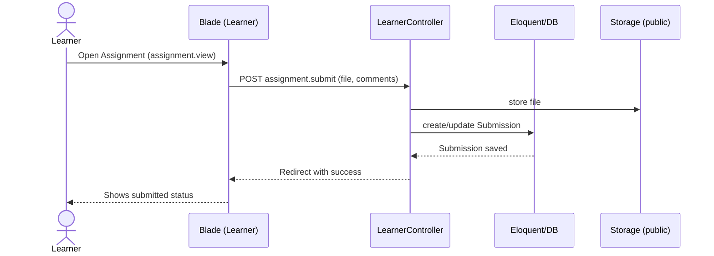
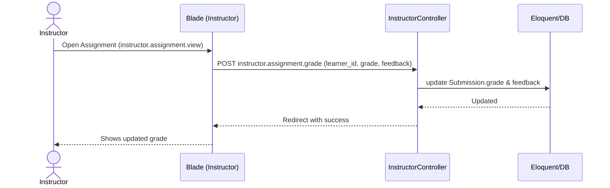

## System Sitemap and Flows

This document visualizes the key screens and flows for Learners and Instructors.

### Sitemap (high-level)
```mermaid
graph TD
  W[Welcome] --> A[Auth: Login / Register]
  A --> D[Dashboard]

  D -->|Learner| LC[Course Detail (course.view)]
  D -->|Instructor| IC[Instructor Courses (instructor.index)]
  D --> P[Profile]

  LC --> LA[Assignment (assignment.view)]
  LA --> LS[Submit / Finalize / Download]

  IC --> ICC[Course Detail (instructor.course.view)]
  ICC --> IAnn[Announcements]
  ICC --> IAsg[Assignments]
  IAsg --> IAView[Assignment (instructor.assignment.view)]
  IAView --> IAct[Download / Grade / Lock-Unlock]
```

### Flowchart (role-based app flow)
```mermaid
flowchart TD
  start([Visit Welcome]) --> auth{Login or Register}
  auth --> dash[Dashboard]
  dash -->|Learner| l_course[Open Course (course.view)]
  l_course --> l_assgn[Open Assignment (assignment.view)]
  l_assgn --> l_submit[Submit / Finalize / Download]
  dash -->|Instructor| i_index[Instructor Courses (instructor.index)]
  i_index --> i_course[Open Course (instructor.course.view)]
  i_course --> i_ann[Post Announcements]
  i_course --> i_assgn[Open Assignment (instructor.assignment.view)]
  i_assgn --> i_actions[Download / Grade / Lock-Unlock]
  dash --> prof[Profile]
  prof --> dash
  l_submit --> dash
  i_actions --> dash
```

### Sequence: Learner submits assignment


### Sequence: Instructor grades submission

